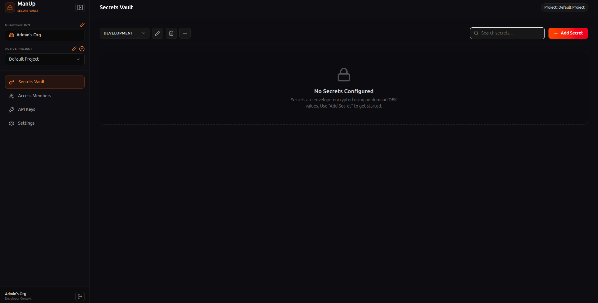
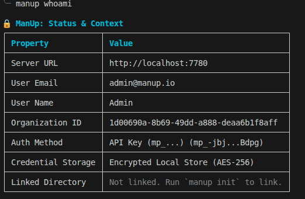

# ManUp 🔒

[](https://github.com/Amanbig/ManUp/actions/workflows/ci.yml)
[](LICENSE)
[](https://hub.docker.com/r/procoder588/manup)
[](https://hub.docker.com/r/procoder588/manup/tags)

ManUp is an open-source, self-hosted Secrets Management platform designed to securely store, manage, and orchestrate environment secrets across your projects, teams, and environments. Built with a modern, responsive user experience and robust Role-Based Access Control (RBAC), ManUp provides a lightweight, developer-friendly alternative to Infisical and HashiCorp Vault.

---

## Table of Contents

- [Features](#-features)
- [Architecture](#️-architecture)
- [Official CLI Tool (manup-cli)](#-official-cli-tool-manup-cli)
- [Quick Start with Docker Compose](#-quick-start-with-docker-compose)
- [Running Pre-built Registry Images](#-running-pre-built-registry-images)
- [Configuration Parameters](#️-configuration-parameters)
- [Local Development Setup](#️-local-development-setup)
- [Contributing](#-contributing)
- [Security](#-security)
- [Code of Conduct](#-code-of-conduct)
- [License](#-license)

---

## 🚀 Features

- **Centralized Secrets Vault**: Create, update, and manage encrypted secrets with a secure dashboard.
- **Granular RBAC**: Assign roles (`Owner`, `Admin`, `Viewer`) to restrict access. Ensure only authorized users perform destructive actions (editing environments, managing API keys, deleting secrets).
- **Organization Member Management**: Safely invite or remove members from the organization with built-in role hierarchies, cascade-deleting memberships when a user is removed.
- **Fine-Grained API Key Scopes**: Provision access keys configured with either `full` (read/write) or `read-only` scope to safely gate mutating actions in automation pipelines.
- **Project & Environment Isolation**: Group configuration variables by projects and isolated environments (e.g., Development, Staging, Production).
- **Easy Self-Hosting**: Deploy instantly using Docker and Docker Compose, powered by an embedded PostgreSQL database (`PGLITE`).
- **Default Admin Auto-Seeding**: Bootstrap the platform instantly by pre-configuring the default administrator credentials through environment variables, skipping the signup flow.
- **Secure Authentication**: Built-in cookie-based authentication with `httpOnly` secure cookies to mitigate token interception/XSS vulnerabilities, complete with user session logout confirmation.
- **Security-Hardened Sensitive Settings**: Protect critical configuration updates (email, username, account deletion) behind a password challenge, guarding the organization owner from self-deletion.



---

## 🏗️ Architecture

ManUp is structured as a monorepo consisting of two primary packages:

1. **Frontend (`/client`)**: A premium Single-Page Application (SPA) built with **React 19**, **TypeScript**, **TailwindCSS v4**, and **Vite**. Features a modern, collapsible icon-only sidebar, responsive data tables, and interactive confirmation overlays.
2. **Backend (`/server`)**: A robust REST API server built with **Node.js**, **Express**, and **TypeScript**. Relies on **Drizzle ORM** for database interaction and uses **PGLite** (embedded PostgreSQL in Node.js) for simple, serverless-like data persistence.

When packaged for production, the client SPA is compiled and served directly by the Express backend server as a single lightweight container.

---

## 💻 Official CLI Tool (manup-cli)

ManUp includes an official, standalone Command Line Interface: **[manup-cli](https://github.com/Amanbig/manup-cli)** (`npm install -g manup-cli`).

The CLI allows developers, CI/CD pipelines, and server scripts to seamlessly authenticate with your self-hosted ManUp Vault server, sync environment variables, and inject secrets directly into application processes.

### 1. Installation

Install globally via `npm` or run statelessly using `npx`:

```bash
# Global installation
npm install -g manup-cli

# Or run statelessly
npx manup-cli --help
```

### 2. Authentication

Authenticate with your self-hosted ManUp server instance:

```bash
# Interactive login (Direct Email/Username & Password or API Key)
manup login

# Non-interactive direct login
manup login --server http://localhost:7780 --user admin@manup.io --password adminpassword123

# Non-interactive API key login
manup login --server http://localhost:7780 --api-key mp_your_api_key
```

* **Machine-Bound AES Security**: Credentials stored locally in `~/.config/manup-cli-nodejs/` are encrypted with **AES-256-CBC** using a key derived from your machine identity with strict POSIX permissions (`0600`).
* **Environment Overrides**: For CI/CD automation, set `MANUP_SERVER_URL` and `MANUP_API_KEY` (or `MANUP_TOKEN`) in environment variables.

### 3. Workspace Linking & Secret Injection

```bash
# 1. Link current directory to a project & environment
cd /path/to/my-app
manup init

# 2. List or inspect decrypted secrets
manup secrets
manup secrets ls --reveal

# 3. Inject secrets directly into runtime processes without writing secrets to disk
manup run -- npm start
manup run -- node server.js
```



👉 View full CLI source code and documentation: **[github.com/Amanbig/manup-cli](https://github.com/Amanbig/manup-cli)**

---

## ⚡ Quick Start with Docker Compose

Ensure you have [Docker](https://docs.docker.com/get-docker/) and [Docker Compose](https://docs.docker.com/compose/install/) installed.

1. **Clone the Repository**:
   ```bash
   git clone https://github.com/Amanbig/ManUp.git
   cd ManUp
   ```

2. **Configure Environment Variables**:
   Create a `.env` file or configure values directly in your container orchestration setup.
   Key environment variables inside `docker-compose.yml`:
   * `MASTER_KEY`: A 32-character hexadecimal key used to encrypt/decrypt secrets.
   * `JWT_SECRET`: Secret token signature key.
   * `PORT`: Server port (default: `7780`).

3. **Start the Platform**:
   ```bash
   docker compose up --build -d
   ```

4. **Access the Web Dashboard**:
   Open [http://localhost:7780](http://localhost:7780) in your browser.

---

## 🐳 Running Pre-built Registry Images

ManUp images are automatically built and published via GitHub Actions to GitHub Container Registry (GHCR) and Docker Hub.

### 1. Pull the Image
Images are tagged by release version (e.g. `1.0.0`), with `latest` always pointing at the newest stable release.

```bash
# From Docker Hub
docker pull procoder588/manup:latest
docker pull procoder588/manup:0.3.1

# From GitHub Container Registry (GHCR)
docker pull ghcr.io/amanbig/manup:main
```

### 2. Run via Docker CLI
Run a self-contained vault instance on port `7780` with automated local storage (optionally seeding a default admin user to skip the signup flow):
```bash
docker run -d \
  --name manup-vault \
  -p 7780:7780 \
  -e DB_TYPE="PGLITE" \
  -e MASTER_KEY="your_32_character_hexadecimal_key" \
  -e JWT_SECRET="your_jwt_signing_secret_key" \
  -e REFRESH_TOKEN_SECRET="a_different_jwt_signing_secret_key" \
  -e DEFAULT_ADMIN_EMAIL="admin@manup.io" \
  -e DEFAULT_ADMIN_PASSWORD="adminpassword123" \
  -e DEFAULT_ADMIN_NAME="Admin User" \
  -e DEFAULT_ADMIN_USERNAME="admin" \
  -v manup_data:/app/manup \
  --restart always \
  procoder588/manup:latest
```

---

## ⚙️ Configuration Parameters

| Variable | Description | Default Value | Required |
| :--- | :--- | :--- | :--- |
| `PORT` | Port the backend server listens on. | `7780` | No |
| `DB_TYPE` | Type of Postgres DB. Choose `PGLITE` or leave blank for external DB. | `PGLITE` | Yes |
| `DB_DIR` | Path to persist SQLite-like files when using `PGLITE`. | `/app/manup` | Only for `PGLITE` |
| `DATABASE_URL` | Connection string to external Postgres instance. | — | Only if `DB_TYPE` !== `PGLITE` |
| `MASTER_KEY` | 32-character hex key for secret encryption. | — | Yes |
| `JWT_SECRET` | Secret key for signing access-token cookies. | — | Yes |
| `REFRESH_TOKEN_SECRET` | Secret key for signing refresh-token cookies. Must be different from `JWT_SECRET`. | — | Yes |
| `ENABLE_SIGNUP` | `true`/`false` — whether the public signup form/endpoint is enabled. If unset, defaults to disabled once `DEFAULT_ADMIN_EMAIL`/`DEFAULT_ADMIN_PASSWORD` are set, enabled otherwise. | — | No |
| `DEFAULT_ADMIN_EMAIL` | The default administrator email to pre-seed on first startup. | — | No |
| `DEFAULT_ADMIN_PASSWORD` | The default administrator password to pre-seed on first startup. | — | No |
| `DEFAULT_ADMIN_NAME` | The default administrator display name override (used with email/password). | `Admin` | No |
| `DEFAULT_ADMIN_USERNAME` | The default administrator username override (used with email/password). | `admin` | No |

More variables (SMTP, admin name/username overrides, `ALLOWED_ORIGINS`) are documented on the [Wiki](https://github.com/Amanbig/ManUp/wiki/Environment-Variables).

---

## 🛠️ Local Development Setup

To run both client and server locally without Docker:

### Prerequisites
- Node.js >= 20.x
- npm >= 10.x

### Steps

1. **Install Dependencies**:
   From the root directory, install all client and server dependencies:
   ```bash
   cd client && npm install
   cd ../server && npm install
   ```

2. **Setup Server Config**:
   Create `server/.env` with the following variables:
   ```env
   PORT=7780
   DB_TYPE=PGLITE
   DB_DIR=./manup_dev
   MASTER_KEY=9a8b7c6d5e4f3g2h1i0j9k8l7m6n5o4p
   JWT_SECRET=super_secret_jwt_sign_key_manup_2026
   REFRESH_TOKEN_SECRET=a_different_refresh_token_sign_key_2026
   ```

3. **Run Services**:
   - **Start Backend API** (Terminal 1):
     ```bash
     cd server
     npm run dev
     ```
   - **Start Frontend Dev Server** (Terminal 2):
     ```bash
     cd client
     npm run dev
     ```

---

## 🤝 Contributing

Contributions are welcome — bug fixes, features, or docs. See [CONTRIBUTING.md](CONTRIBUTING.md) for the development workflow, code style (Prettier/ESLint), commit conventions, and the PR process. Check the [Wiki](https://github.com/Amanbig/ManUp/wiki) for deeper guides beyond this README.

---

## 🔐 Security

ManUp handles secrets, so security reports get priority. **Do not open a public issue for vulnerabilities.** See [SECURITY.md](SECURITY.md) for how to report privately and what's in scope.

---

## 📜 Code of Conduct

This project follows the [Contributor Covenant Code of Conduct](CODE_OF_CONDUCT.md). By participating, you're expected to uphold it.

---

## 📄 License

ManUp is released under the [MIT License](LICENSE).
